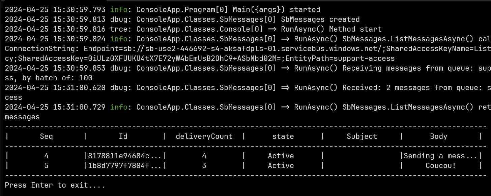
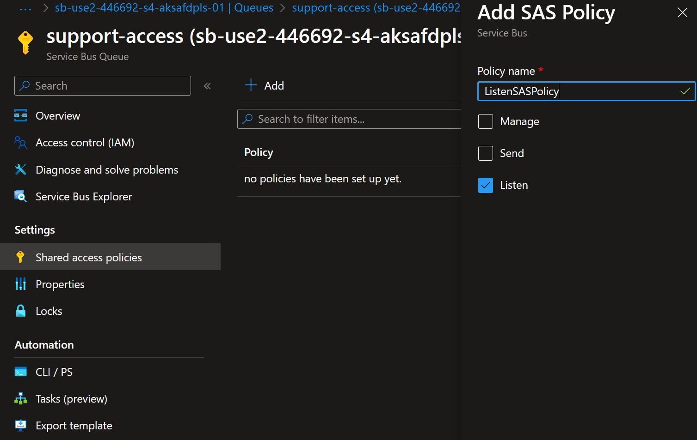
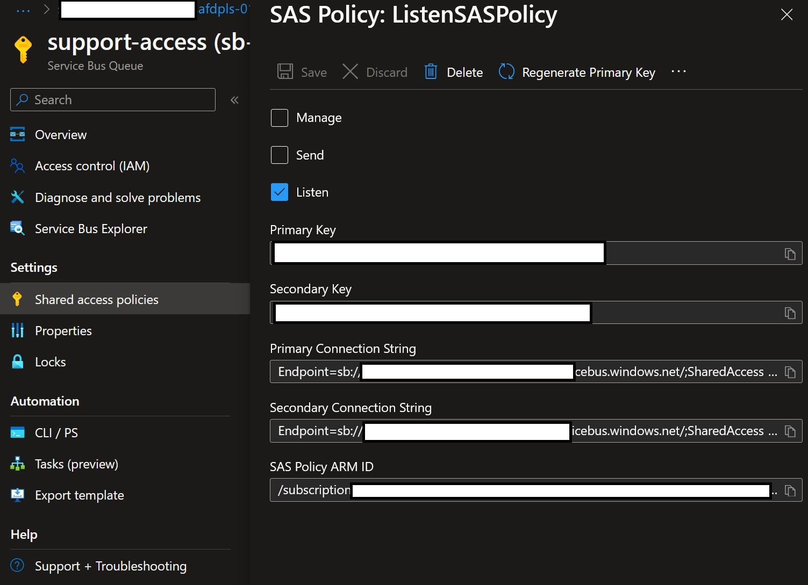

# Service Bus Queue Reader Console App

## Overview

This .NET Console App performs a very simple task:

- Using a Connection String to an Azure Service Bus Queue,

- It Receives all the messages in the Queue and displays them in the Console.

Here is a sample result:

> Notes:
>
> - The Connection String:
>
>   - must be set in the `appsettings.json` file.
>
>   - Should be created at the Queue level, as a Shared Access Policy, with only the `Listen` permission:
>     - Creation
>     
>
>     - Connection String retrieval
>     

## Additional information

- The code uses SEQ ([Seq.Extensions.Logging NuGet package](https://www.nuget.org/packages/seq.extensions.logging)). This can be removed easily.

- The Messages are:
  - `Received`: meaning they are counted as `delivered` (it increments their `DeliveryCount`),
  - Then `Abandoned` right away, so their lock is removed, meaning they can be picked up by another `receiver` or `processor` right away.

- The `Dead-lettered` messages are not received.

## References

[Service Bus Queues](https://learn.microsoft.com/en-us/azure/service-bus-messaging/service-bus-queues-topics-subscriptions#queues)

[Service Bus Explorer](https://learn.microsoft.com/en-us/azure/service-bus-messaging/explorer)

[Azure Service Bus client library for .NET](https://github.com/azure/azure-sdk-for-net/tree/main/sdk/servicebus/Azure.Messaging.ServiceBus/samples)
